# 🗺️ Mapas Mermaid — Modelos, Testes, Algoritmos e Conceitos

Esquemas visuais que resumem **quando e como** usar o que está no
[DICIONARIO_DATA_SCIENCE.md](DICIONARIO_DATA_SCIENCE.md).
Cada diagrama indica o módulo de origem (`M##`) e reproduz as regras de decisão apresentadas em aula.

> Os diagramas renderizam automaticamente no GitHub, no VS Code (com extensão Markdown Preview Mermaid)
> e em qualquer visualizador com suporte a Mermaid.

---

## 1. Mapa geral do curso

Como as 27 disciplinas se encadeiam, da base estatística à entrega em produção.

```mermaid
flowchart LR
    subgraph BASE["Fundamentos"]
        M1["M1 · Fundamentos de Estatística"]
        M2["M2 · Programação com Python"]
    end

    subgraph PREP["Obtenção e preparação dos dados"]
        M25["M25 · Crawlers e Web Scraping"]
        M4["M4 · Engenharia de Dados / SQL"]
        M24["M24 · Data Wrangling"]
    end

    subgraph NS["Machine Learning não supervisionado"]
        M14["M14 · Análise de Cluster"]
        M15["M15 · Análise Fatorial e PCA"]
        M16["M16 · ANACOR e MCA"]
        M17["M17 · Exercícios aplicados"]
    end

    subgraph SUP["Machine Learning supervisionado"]
        M18["M18 · Regressão Linear"]
        M19["M19 · Modelos Logísticos"]
        M20["M20 · Dados de Contagem"]
        M21["M21 · Modelagem Multinível"]
    end

    subgraph ESP["Dados com estrutura própria"]
        M23["M23 · Séries Temporais"]
        M26["M26 · Text Mining e NLP"]
        M8["M8 · Social Network Analysis"]
    end

    subgraph DEC["Otimização e apoio à decisão"]
        M27["M27 · Pesquisa Operacional"]
        M6["M6 · Computação Evolucionária"]
        M13["M13 · AHP e AHP-Gaussiano"]
        M10["M10 · Analytics e Gestão de Riscos"]
    end

    subgraph ENT["Entrega e operação"]
        M3["M3 · BI e Data Visualization"]
        M22["M22 · Big Data e Deployment"]
        M7["M7 · Cloud Computing"]
    end

    subgraph GOV["Contexto e governança"]
        M12["M12 · LGPD"]
        M5["M5 · Metodologias Ágeis"]
        M11["M11 · Liderança"]
        M9["M9 · Conjuntura Econômica"]
    end

    BASE --> PREP
    PREP --> NS
    PREP --> SUP
    PREP --> ESP
    NS --> SUP
    NS --> DEC
    SUP --> DEC
    ESP --> DEC
    DEC --> ENT
    SUP --> ENT
    GOV -.->|"atravessa todas as etapas"| PREP
    GOV -.-> ENT
```

---

## 2. Escolha do modelo supervisionado pela natureza de Y

A regra central dos módulos 18 a 21 — todos são **GLM**, o que muda é a variável dependente.

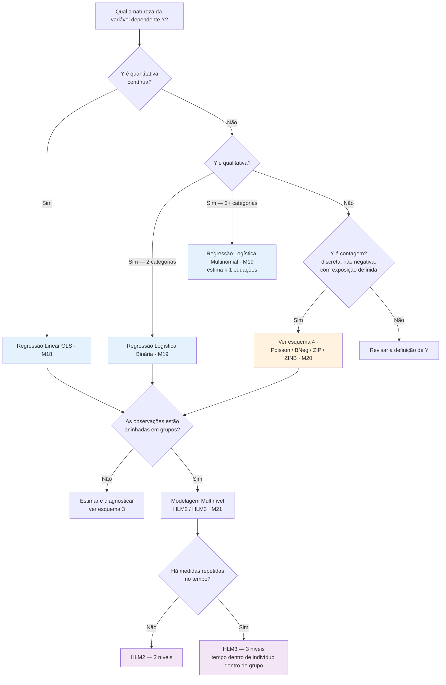

---

## 3. Diagnóstico de um modelo de regressão linear

Sequência de testes e correções do módulo 18.

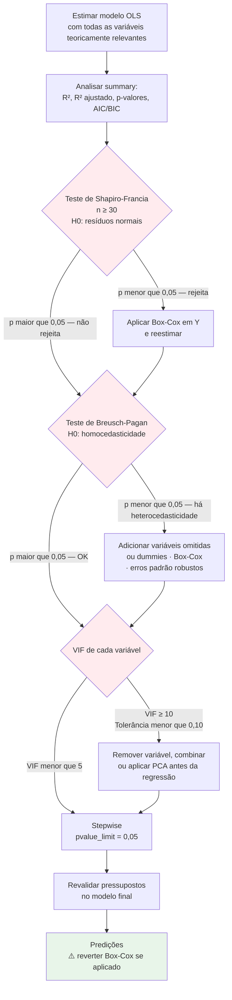

---

## 4. Modelos para dados de contagem

Fluxo de decisão entre Poisson, Binomial Negativa, ZIP e ZINB (M20).

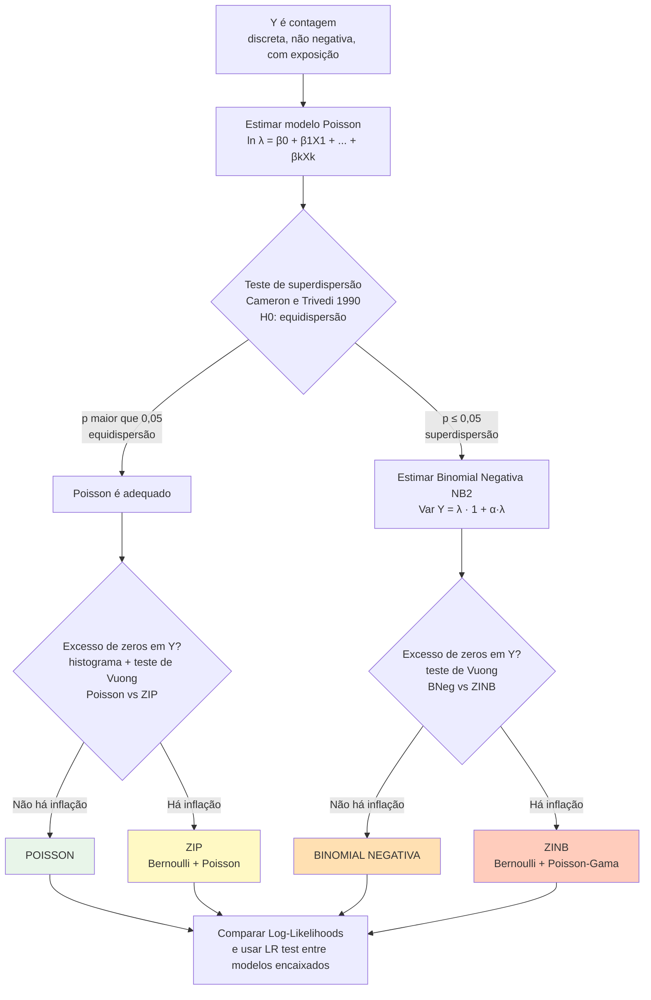

> ⚠️ Erros comuns do módulo: usar OLS em variável de contagem (mesmo com Box-Cox, os resíduos continuam não normais);
> assumir equidispersão sem testar; e usar LR test para comparar Poisson × ZIP (modelos **não encaixados** → teste de Vuong).

---

## 5. Modelagem multinível — por que e como

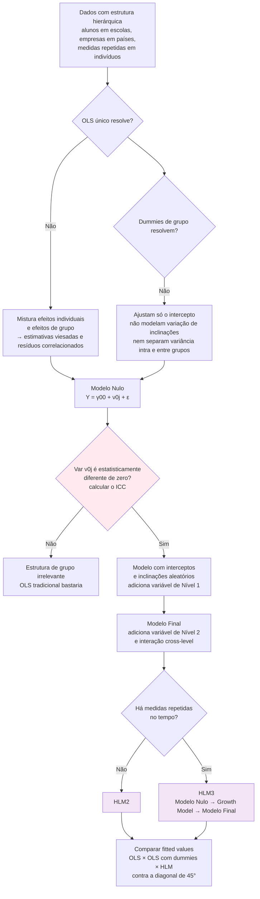

---

## 6. Escolha da técnica não supervisionada

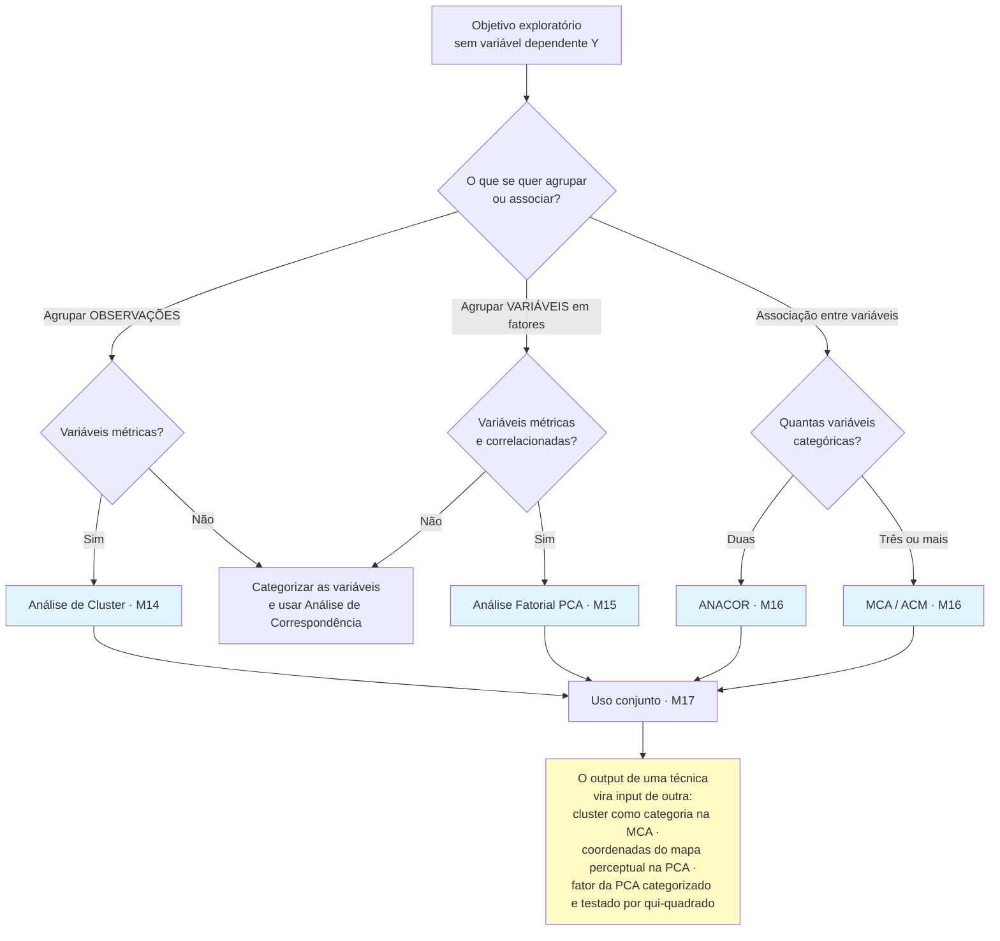

> Característica comum às quatro: são **exploratórias**, avaliam interdependência,
> **não servem para inferência** fora da amostra e devem ser **refeitas** se observações ou variáveis mudarem.

---

## 7. Análise de Cluster — fluxo completo

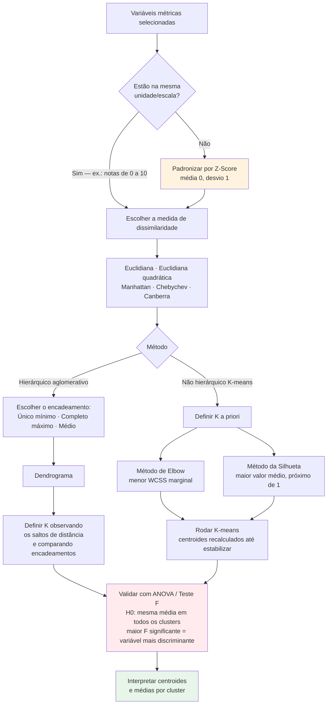

> O output do método hierárquico pode servir de **input** para o K-means (definição inicial de K).
> A técnica é **muito sensível a outliers** e o dendrograma fica ilegível com muitas observações — nesse caso, K-means.

---

## 8. Análise Fatorial PCA — fluxo completo

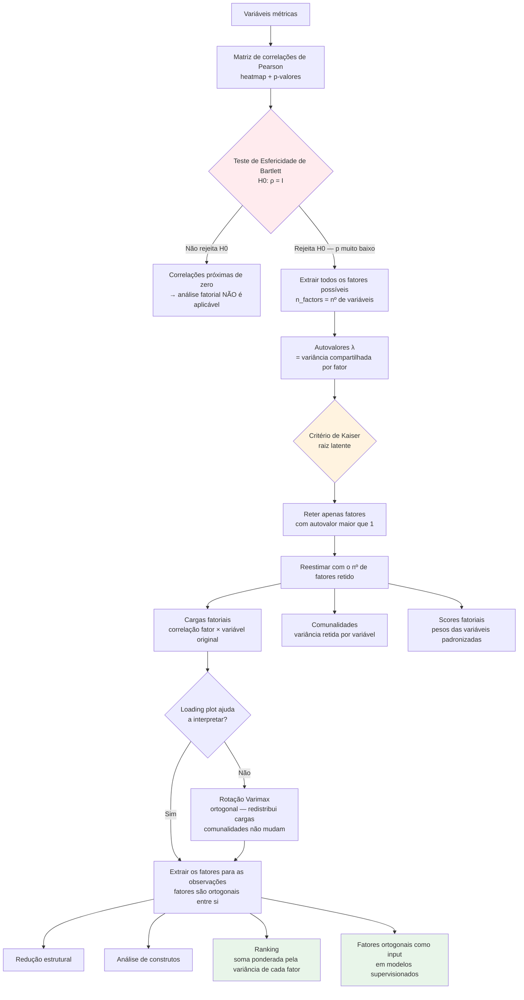

---

## 9. Análise de Correspondência — ANACOR e MCA

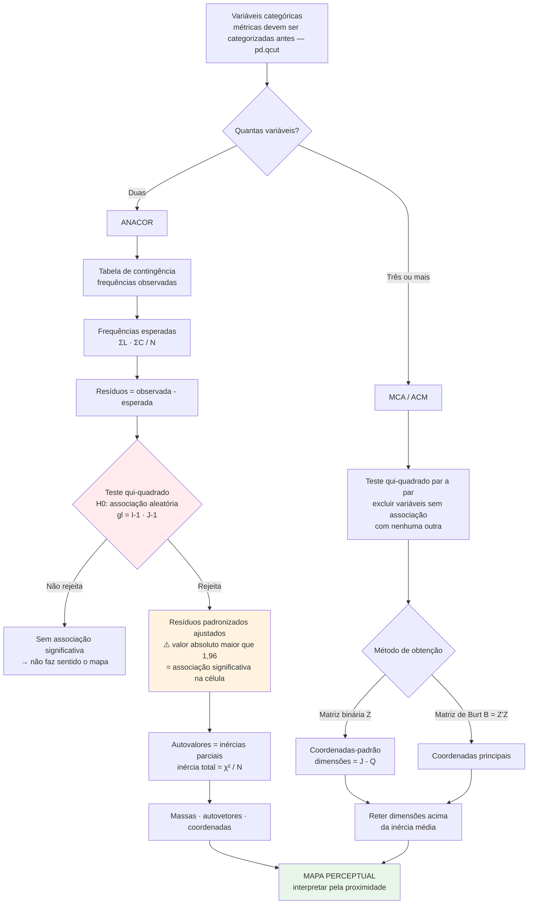

---

## 10. Testes estatísticos por finalidade

Todos os testes do dicionário, organizados pela pergunta que respondem.

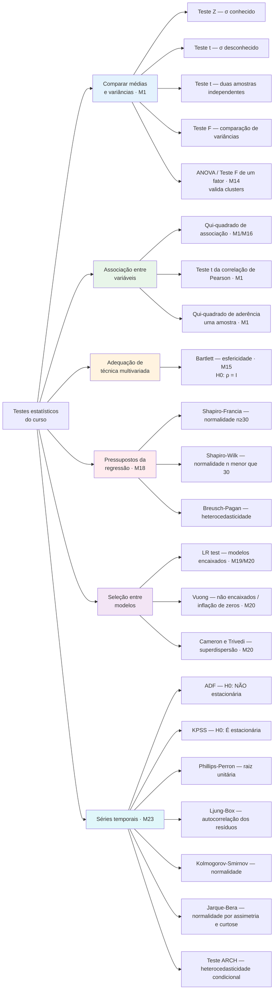

> ⚠️ Atenção às hipóteses invertidas: no **ADF**, H0 é "não estacionária"; no **KPSS**, H0 é "estacionária".
> No **Ljung-Box**, o resultado desejado é **não rejeitar** H0 (resíduos independentes).

---

## 11. Séries temporais — pipeline completo

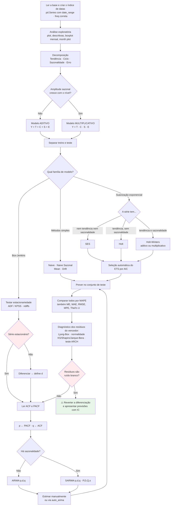

### Identificação de p e q pelos correlogramas

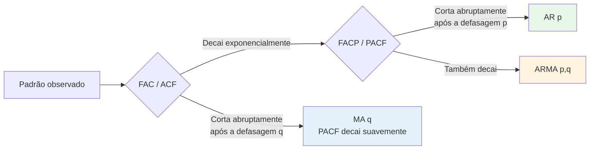

---

## 12. Métricas de avaliação por tipo de problema

```mermaid
flowchart TD
    M["Como avaliar o modelo?"]

    M --> A["REGRESSÃO · M18"]
    A --> A1["R² · R² ajustado"]
    A --> A2["AIC · BIC — menor é melhor"]
    A --> A3["Erro padrão e p-valor dos coeficientes"]

    M --> B["CLASSIFICAÇÃO · M19"]
    B --> B1["Matriz de confusão<br/>TP · TN · FP · FN"]
    B1 --> B2["Sensitividade = TP/TP+FN"]
    B1 --> B3["Especificidade = TN/TN+FP"]
    B1 --> B4["Acurácia — ⚠️ engana em classes desbalanceadas"]
    B --> B5["Curva ROC → AUC<br/>0,5 aleatório · maior que 0,8 excelente"]
    B5 --> B6["GINI = 2·AUC - 1"]
    B --> B7["Pseudo R² McFadden<br/>0,2-0,4 excelente"]
    B --> B8["Log-Likelihood e LR test"]

    M --> C["CONTAGEM · M20"]
    C --> C1["Log-Likelihood — menos negativo é melhor"]
    C --> C2["LR test e teste de Vuong"]

    M --> D["PREVISÃO / SÉRIES · M23"]
    D --> D1["ME e MPE — medem viés"]
    D --> D2["MAE · RMSE — medem magnitude"]
    D --> D3["MAPE — comparação padrão fora da amostra"]
    D --> D4["Theil's U — menor que 1 melhor que passeio aleatório"]

    M --> E["CLUSTER · M14"]
    E --> E1["WCSS — método de Elbow"]
    E --> E2["Silhueta — próximo de 1"]
    E --> E3["Estatística F da ANOVA por variável"]

    M --> F["REDES · M8"]
    F --> F1["Modularidade — maior que 0,3 significativa"]

    style B fill:#e3f2fd
    style D fill:#e0f7fa
    style E fill:#e1f5fe
```

---

## 13. Algoritmo Genético — ciclo e operadores

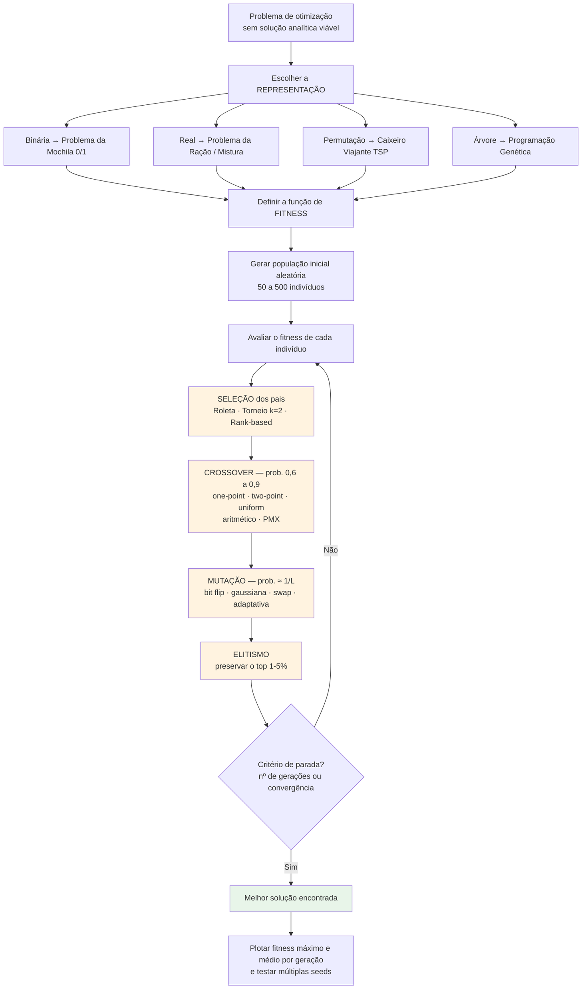

### Equilíbrio exploration × exploitation

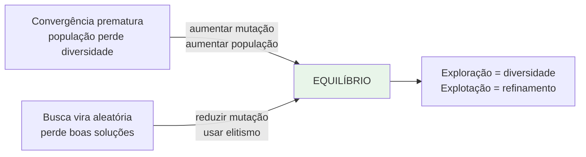

---

## 14. Pesquisa Operacional e apoio multicritério

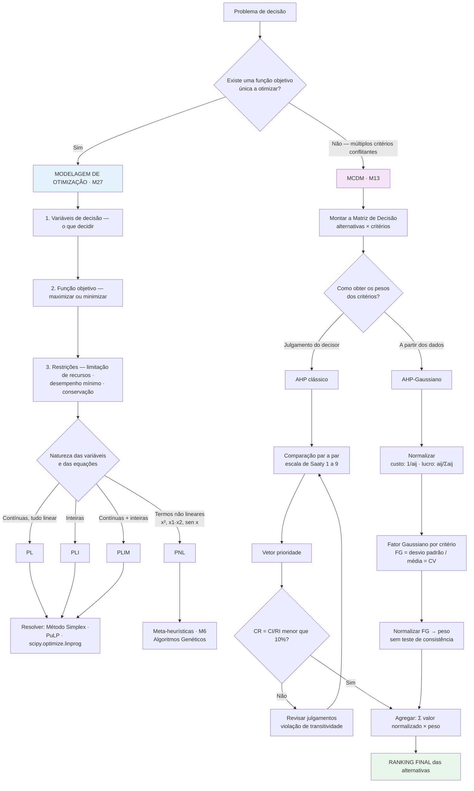

---

## 15. Text Mining, NLP e Análise de Sentimentos

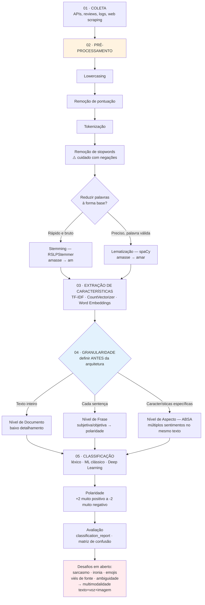

> Princípio central do módulo: **"qualidade do dado > qualquer algoritmo de ponta"**.
> O pré-processamento impacta diretamente a acurácia final.

---

## 16. Social Network Analysis — métricas e comunidades

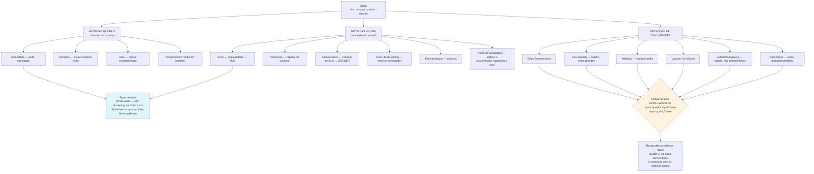

---

## 17. Analytics e Gestão de Riscos

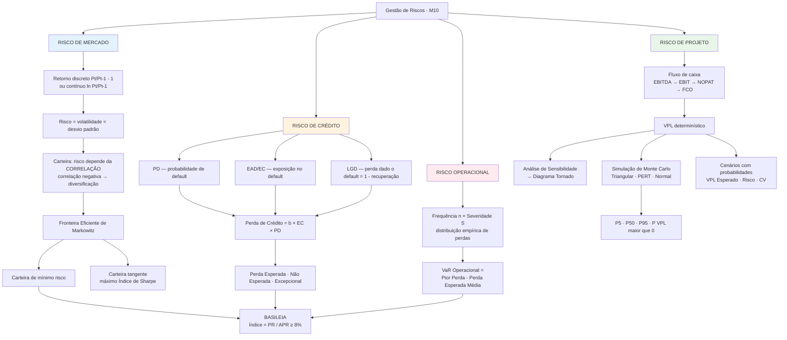

---

## 18. Do dado ao modelo em produção — CRISP-DM e MLOps

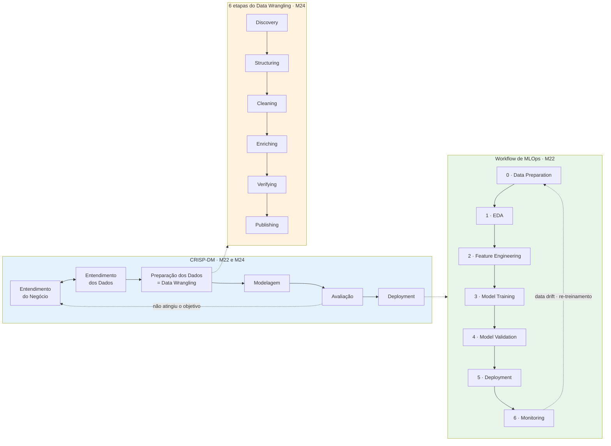

### Versionamento e serving com MLflow

```mermaid
flowchart LR
    A["Treinar modelo<br/>mlflow.start_run"] --> B["MLflow Tracking<br/>params · metrics · artifacts · signature"]
    B --> C["MLflow Model Registry"]
    C --> D["Staging"]
    D --> E["Produção"]
    E --> F["Arquivado"]

    E --> G{"Como servir?"}
    G -->|"mlflow deployments"| H["Container Docker →<br/>Databricks Model Serving · SageMaker ·<br/>Kubernetes · Azure ML"]
    G -->|"mlflow models serve"| I["Flask local<br/>ou batch prediction"]

    H --> J["Proxy reverso NGINX<br/>balanceia entre múltiplas versões"]
    I --> J
    J --> K["Monitoramento<br/>⚠️ data drift"]
    K -.->|"re-treinar"| A

    style C fill:#fff3e0
    style E fill:#e8f5e9
    style K fill:#ffebee
```

---

## 19. Arquitetura de dados e Big Data

```mermaid
flowchart TD
    A["Os 5V's do Big Data<br/>Volume · Velocidade · Variedade · Veracidade · Valor"] --> B{"Como processar?"}

    B -->|"Lote, tolerante a I/O em disco"| C["Hadoop<br/>HDFS + MapReduce + YARN"]
    B -->|"Velocidade, in-memory"| D["Apache Spark<br/>RDD · DataFrame · DAG"]
    D --> D1["Spark SQL — Catalyst + Tungsten"]
    D --> D2["MLlib — machine learning"]
    D --> D3["Spark Streaming — tempo real"]

    B -->|"Fluxo contínuo de eventos"| E["Kafka<br/>tópicos · partições · brokers<br/>Connect e Streams"]
    E --> E1["Windowing<br/>Tumbling · Hopping · Session<br/>+ watermark para dados atrasados"]
    E --> E2["CDC — Change Data Capture<br/>baseado em log, gatilho ou consulta"]

    C --> F["EVOLUÇÃO DAS ARQUITETURAS"]
    D --> F
    E --> F

    F --> F1["Data Warehouse<br/>só estruturados → BI"]
    F1 --> F2["Data Lake<br/>todos os formatos → BI + DS/ML"]
    F2 --> F3["Data Lakehouse<br/>unificado com camada de<br/>metadados e governança"]

    F3 --> G["Arquitetura Medalhão"]
    G --> G1["BRONZE — ingestão bruta e histórico"]
    G1 --> G2["SILVER — filtrado, limpo, enriquecido"]
    G2 --> G3["GOLD — agregações de negócio"]
    G3 --> H["Streaming Analytics · BI · DS/ML · Data Sharing"]

    G -.->|"sustentada por"| I["Data Quality e Governança"]

    F3 --> J["Otimizações"]
    J --> J1["Formatos colunares<br/>Parquet · ORC — até 87% menor, 34× mais rápido"]
    J --> J2["Particionamento por tempo<br/>partition pruning"]
    J --> J3["Apache Iceberg — formato de tabela<br/>ACID · evolução de esquema · time travel"]

    style A fill:#e3f2fd
    style G fill:#fff3e0
    style H fill:#e8f5e9
```

---

## 20. Governança, ética e conformidade

Conceitos que atravessam todo o ciclo de dados (M3, M7, M12, M25).

```mermaid
flowchart TD
    A["Dado pessoal em qualquer etapa do ciclo"] --> B["LGPD · Lei 13.709/2018 · M12"]

    B --> C["Agentes<br/>Titular · Controlador · Operador ·<br/>Encarregado DPO · ANPD"]
    B --> D["10 Princípios Art. 6º<br/>finalidade · adequação · necessidade ·<br/>não discriminação · livre acesso · transparência ·<br/>segurança · prevenção · qualidade · responsabilização"]
    B --> E["Bases legais Art. 7º<br/>consentimento · legítimo interesse ·<br/>obrigação legal · execução de contrato ·<br/>pesquisa · proteção à vida · tutela da saúde"]
    B --> F["Direitos do titular Art. 18<br/>acesso · correção · anonimização ·<br/>portabilidade · revogação ·<br/>revisão de decisão automatizada"]

    A --> G["Coleta na web · M25"]
    G --> G1{"Três critérios antes<br/>de qualquer scraping"}
    G1 --> G2["Consentimento — Termos de Serviço"]
    G1 --> G3["Problemas físicos — não sobrecarregar"]
    G1 --> G4["Intencionalidade — o que se faz com os dados"]
    G1 -.->|"Art. 7º §3º"| G5["Dados públicos: avaliar<br/>finalidade, boa-fé e interesse público"]

    A --> H["Governança de Dados · M3"]
    H --> H1["Pessoas · Processos · Tecnologia"]
    H --> H2["Riscos: Shadow IT · vazamentos ·<br/>fraude · cyber attacks"]
    H --> H3["NDA — acordo de confidencialidade"]

    A --> I["Segurança na nuvem · M7"]
    I --> I1["Modelo de Responsabilidade Compartilhada<br/>provedor: segurança DA nuvem<br/>cliente: segurança NA nuvem"]
    I --> I2["IAM: Autenticação · Autorização · Auditoria"]
    I2 --> I3["Princípio do Menor Privilégio"]

    style B fill:#ffebee
    style G1 fill:#fff3e0
    style I3 fill:#e8f5e9
```

---

## Como navegar

| Se a pergunta é… | Vá para o esquema |
|---|---|
| Qual modelo usar para meu Y? | 2 · 4 · 5 |
| Meu modelo de regressão é válido? | 3 |
| Quero explorar dados sem variável resposta | 6 · 7 · 8 · 9 |
| Que teste aplicar aqui? | 10 |
| Como prever uma série no tempo? | 11 |
| Como avaliar o resultado? | 12 |
| Como otimizar ou decidir entre alternativas? | 13 · 14 |
| Como tratar texto ou redes? | 15 · 16 |
| Como medir risco financeiro? | 17 |
| Como levar o modelo para produção? | 18 · 19 |
| O que preciso respeitar juridicamente? | 20 |

---

_Esquemas derivados do [DICIONARIO_DATA_SCIENCE.md](DICIONARIO_DATA_SCIENCE.md) e dos resumos das 27 disciplinas — MBA em Data Science e Analytics, USP/ESALQ._
